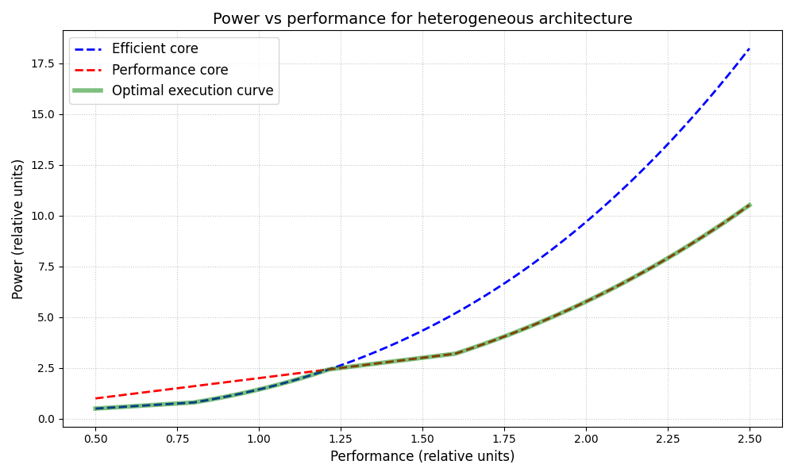
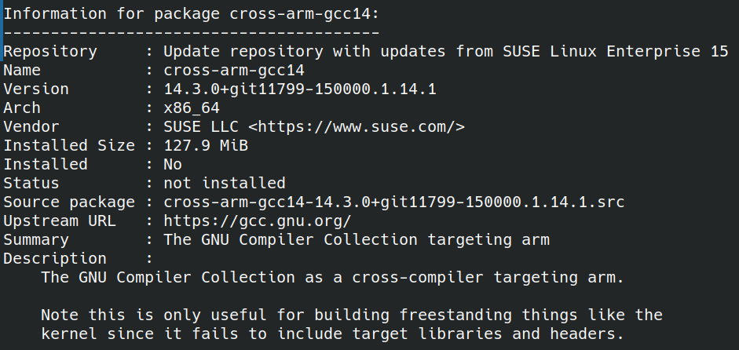

# Microarchitecture of Contemporary Microprocessors Homework I
## 1. EAS

## 2. Pipeline execution
### Sources
[2_function.cc](./2_function.cc)

[2_function.s](./2_function.s)

### Compilation

- **Compiler:** ARM GCC (`arm-suse-linux-gnueabi-g++-14`)

- **Flags:** `-march=armv7-a -O0 -S`

### Assumptions

1. **Flag register (CC):** `cmp` updates flags at the end of E2. `bgt` reads flags in E1 (resolution takes 3 cycles total).
2. **Address updates:** The pre-indexed store `str fp, [sp, #-4]!` computes the new `sp` in the ALU. The updated `sp` is available for bypassing at the end of E2.
3. **Memory hazards:** If a `ldr` reads from the exact address written by a preceding `str` (e.g., instructions 21 and 22), the `ldr` must wait for the `str` to finish M3. There is no advanced store-to-load forwarding.
4. **Branch prediction:** The branch `bgt .L2` is not taken (input condition `arr[0] <= 99` is true). The perfect branch predictor ensures zero fetch delays.

### (a) Diagram

**Legend:**

* **IQ range:** Clock cycles spent in the instruction queue before issue
* **-:** Stage is not utilized by the instruction
* **Width = 2, IQ = 2**

| № | Instruction | F | D | IQ | E1 | E2 / M1 | M2 | M3 | WB | Stall reasons |
| --- | --- | --- | --- | --- | --- | --- | --- | --- | --- | --- |
| 1 | `str fp, [sp, #-4]!` | 1 | 2 | - | 3 | 4 | 5 | 6 | - | `sp` ready at end of E2 (C4) |
| 2 | `add fp, sp, #0` | 1 | 2 | 3-4 | 5 | 6 | - | - | 7 | Waits for `sp` from (1). `fp` ready end of C6 |
| 3 | `sub sp, sp, #20` | 2 | 3 | 4-4 | 5 | 6 | - | - | 7 | Waits for `sp` from (1). Issued with (2) |
| 4 | `str r0, [fp, #-16]` | 2 | 3 | 4-6 | 7 | 8 | 9 | 10 | - | Waits for `fp` from (2). Issue stall until C7 |
| 5 | `mov r3, #0` | 3 | 4 | 5-6 | 7 | 8 | - | - | 9 | Issued with (4). `r3` ready end of C8 |
| 6 | `str r3, [fp, #-8]` | 3 | 4 | 5-8 | 9 | 10 | 11 | 12 | - | Waits for `r3` from (5). IQ stall |
| 7 | `ldr r3, [fp, #-16]` | 4 | 5 | 6-8 | 9 | 10 | 11 | 12 | 13 | Issued with (6). `r3` ready end of C12 |
| 8 | `ldr r3, [r3]` | 4 | 5 | 6-12 | 13 | 14 | 15 | 16 | 17 | Waits for `r3` from (7) from M3 |
| 9 | `cmp r3, #99` | 5 | 6 | 7-16 | 17 | 18 | - | - | 19 | Waits for `r3` from (8) from M3 |
| 10 | `bgt .L2` | 5 | 6 | 7-18 | 19 | - | - | - | - | Waits for flags from (9) from E2 |
| 11 | `ldr r3, [fp, #-16]` | 18 | 19 | - | 20 | 21 | 22 | 23 | 24 | No RAW, issues immediately. `r3` ready C23 |
| 12 | `ldr r2, [r3]` | 18 | 19 | 20-23 | 24 | 25 | 26 | 27 | 28 | Waits for `r3` from (11) |
| 13 | `ldr r3, [fp, #-16]` | 19 | 20 | 21-23 | 24 | 25 | 26 | 27 | 28 | No RAW; issued with (12) |
| 14 | `add r3, r3, #4` | 19 | 20 | 21-27 | 28 | 29 | - | - | 30 | Waits for `r3` from (13) |
| 15 | `ldr r3, [r3]` | 20 | 21 | 22-29 | 30 | 31 | 32 | 33 | 34 | Waits for `r3` from (14) |
| 16 | `add r2, r2, r3` | 20 | 21 | 22-33 | 34 | 35 | - | - | 36 | Waits for `r3` from (15) |
| 17 | `ldr r3, [fp, #-16]` | 21 | 22 | 23-33 | 34 | 35 | 36 | 37 | 38 | In-Order rule: waits for head instruction (16) |
| 18 | `add r3, r3, #8` | 21 | 22 | 23-37 | 38 | 39 | - | - | 40 | Waits for `r3` from (17) |
| 19 | `ldr r3, [r3]` | 22 | 23 | 24-39 | 40 | 41 | 42 | 43 | 44 | Waits for `r3` from (18) |
| 20 | `add r3, r2, r3` | 22 | 23 | 24-43 | 44 | 45 | - | - | 46 | Waits for `r3` from (19). `r2` is ready |
| 21 | `str r3, [fp, #-8]` | 23 | 24 | 25-45 | 46 | 47 | 48 | 49 | - | Waits for `r3` from (20). Writes in C49 |
| 22 | `ldr r3, [fp, #-8]` | 23 | 24 | 25-49 | 50 | 51 | 52 | 53 | 54 | Mem RAW at `fp-8` from (21). Waits for M3 |
| 23 | `mov r0, r3` | 24 | 25 | 26-53 | 54 | 55 | - | - | 56 | Waits for `r3` from (22) |
| 24 | `add sp, fp, #0` | 24 | 25 | 26-53 | 54 | 55 | - | - | 56 | Issued with (23). `sp` ready end of C55 |
| 25 | `ldr fp, [sp], #4` | 25 | 26 | 27-55 | 56 | 57 | 58 | 59 | 60 | Waits for `sp` from (24). `fp` ready C59 |
| 26 | `bx lr` | 25 | 26 | 27-59 | 60 | - | - | - | - | Branch (RET) takes 1 cycle (E1). Total: C60 |

### (b) Performance increase (width = 4)
The performance increase should be minimal, roughly 2-3%.

1. **Code:** The assembly is unoptimized (`-O0`). It frequently spills intermediate values to the stack and immediately reads them back.
2. **Dependencies:** This creates long, strict read-after-write dependency chains, specifically: `Load (M3) -> ALU (E2) -> Load (M3) -> ALU (E2)`.
3. **In-order:** Because the processor uses in-order issue, the Instruction Queue head is constantly stalled waiting for multi-cycle dependencies (3 cycles for memory, 2 cycles for ALU) to resolve.
4. **HW utilization:** Expanding the fetch/decode/issue width and IQ capacity to 4 requires instruction-level parallelism to be effective. Due to the RAW chains, the issue width is dynamically restricted to 1 instruction per cycle for most of the execution.
5. **Cycle savings:** The wider pipeline only provides an advantage during the function prologue initialization (instructions 1-5), saving approximately 2 cycles total. Execution time drops from 60 cycles to ~58 cycles.

## 3. gem5
